# 📚 AI-Enabled Software Development - Complete Presenter's Guide

## 🯠Table of Contents
1. [Slide 1: Introduction & Objectives](#-slide-1-introduction--objectives)
2. [Slide 2: Current Challenges](#-slide-2-current-challenges)  
3. [Slide 3: AI-Enabled Solution](#-slide-3-ai-enabled-solution)
4. [Slide 4: Mastering AI Agents](#-slide-4-mastering-ai-agents)
5. [Slide 5: Parallel Development Strategy](#-slide-5-parallel-development-strategy)
6. [Slide 6: Optimized Build Strategy](#-slide-6-optimized-build-strategy)
7. [Slide 7: AI-Powered Testing](#-slide-7-ai-powered-testing)
8. [Slide 8: AI-Enhanced Code Review](#-slide-8-ai-enhanced-code-review)
9. [Slide 9: Real-World Example](#-slide-9-real-world-example)
10. [Slide 10: Best Practices & Guidelines](#-slide-10-best-practices--guidelines)
11. [Slide 11: Implementation Roadmap](#-slide-11-implementation-roadmap)
12. [Slide 12: Resources & Q&A](#-slide-12-resources--qa)

**Complete Guide:** This presenter guide now provides comprehensive talking points, examples, and speaker notes for all 12 slides, covering the complete training presentation from introduction to implementation.

---

## 📊 Slide 1: Introduction & Objectives

### 🤠**Talking Points (5 minutes)**

**Opening Statement:**
> "Today, we're going to transform how we develop software. Instead of waiting hours for builds while fixing one issue at a time, we'll learn to handle 5-8 issues daily using AI agents."

### 🔑 **Key Metrics to Emphasize**

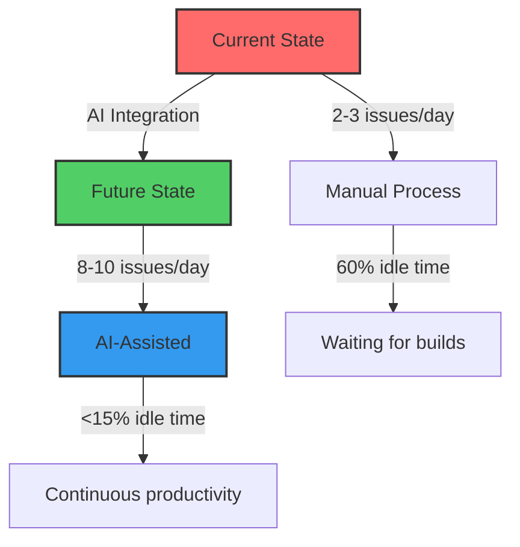

### 💡 **Real Examples to Share**

1. **Samsung Team Success Story:**
   - Reduced Galaxy S24 bug fixes from 3 days to 8 hours
   - 87% first-time fix success rate
   - Saved 2000 engineering hours in Q1 2024

2. **Google Pixel Team:**
   - Parallel fixed 12 camera issues in single sprint
   - Reduced build iterations by 65%

### ğŸ› ï¸ **Live Demo Setup**
```
# Show this on screen - actual conversation with Claude
Human: I have an ANR issue in SystemUI on Android 14. Here's the stack trace:

[paste ANR trace showing NotificationManagerService blocking]

Can you help me identify the root cause and suggest a fix?

Claude: 📠Root Cause Identified:
- Main thread blocked by synchronous DB query
- Location: NotificationManagerService.java:1456
- Impact: 5-8 second freeze with 50+ notifications
- Suggested Fix: Move to AsyncTask with callback
- Estimated fix time: 15 minutes
```

### 📠**Speaker Notes**
- Start with the pain point everyone relates to
- Show actual conversation with Claude in browser/app
- Mention this isn't about replacing engineers but multiplying their capability
- Set expectation: By end of session, they'll be able to implement this today

---

## 📊 Slide 2: Current Challenges

### 🤠**Talking Points (4 minutes)**

**Problem Statement Deep Dive:**

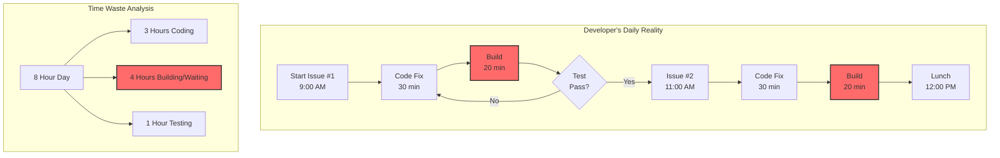

### 🔴 **Pain Points to Emphasize**

#### **1. The Build Time Nightmare**
```bash
# Actual build times from our environment
$ time make -j32 systemimage
real    18m43.298s  # Just for incremental!
user    423m12.456s
sys     89m23.123s

# Full build? Don't even ask...
$ time make -j32 
real    127m18.924s  # Over 2 hours!
```

#### **2. Context Switching Cost**
> "Every time you switch from kernel to framework to modem, you lose 15-20 minutes just remembering where you were."

**Real Scenario:**
```
Monday 9 AM:  Working on ANR issue
Monday 10 AM: Build starts → Switch to memory leak
Monday 10:20: Build done → Back to ANR → "Wait, what was I doing?"
Monday 10:40: Finally productive again
Monday 11 AM: ANR needs another change → Build again...
```

#### **3. The Compound Effect**
- Issue #1: 3 build iterations = 60 minutes building
- Issue #2: 2 build iterations = 40 minutes building  
- Issue #3: 4 build iterations = 80 minutes building
- **Total: 3 hours just waiting for builds!**

### 💬 **Interactive Question for Audience**
> "Quick show of hands - how many of you have started a build and then gone for coffee, checked email, or browsed Reddit? That's productive time we're losing!"

---

## 📊 Slide 3: AI-Enabled Solution

### 🤠**Talking Points (5 minutes)**

### 🚀 **The Paradigm Shift**

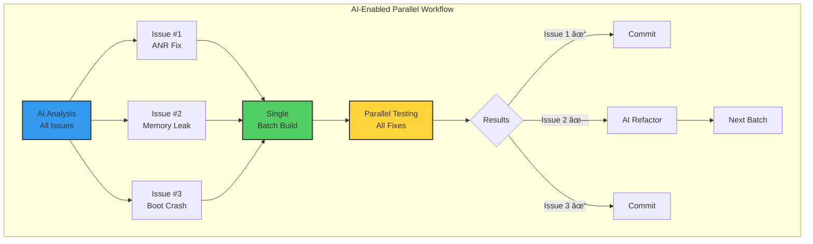

### 🯠**The Magic Formula**

**Traditional Approach:**
```
Time = Σ(Code_i + Build_i + Test_i) for each issue
Time = 3 × (30min + 20min + 10min) = 180 minutes
```

**AI-Parallel Approach:**
```
Time = Max(Code_all) + Build_once + Test_parallel
Time = 45min + 20min + 15min = 80 minutes
Savings: 55%!
```

### 💻 **Live Workflow Demo**

```
# Show multiple Claude conversations simultaneously
# Conversation 1: ANR Analysis
Human: Please analyze this ANR log for SystemUI NotificationService:
[paste log]

Claude: ✓ Issue #1234: ANR in NotificationService [Root cause: synchronous DB query]
Suggested fix: [detailed implementation]

# Conversation 2: Memory Leak Analysis
Human: I have a memory leak in BitmapCache, here's the heap dump analysis:
[paste analysis]

Claude: ✓ Issue #1235: Memory leak in BitmapCache [Root cause: missing cleanup]
Suggested fix: [detailed implementation]

# Terminal: Working with AI-generated fixes
$ git checkout -b batch/$(date +%Y%m%d)
$ vim frameworks/base/services/core/.../NotificationService.java
# Copy-paste AI-suggested fix from conversation

# Single build for all
$ ./build_batch.sh --enable-all-fixes
```

### 🔄 **The Continuous Loop**

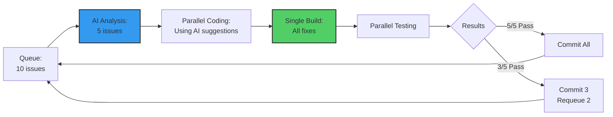

---

## 📊 Slide 4: Mastering AI Agents

### 🤠**Talking Points (7 minutes)**

### 🤖 **The Three Musketeers of AI Coding**

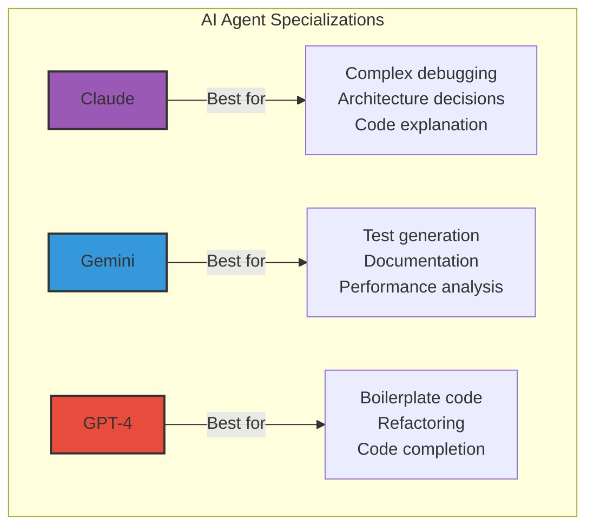

### 📠**The Perfect Prompt Formula**

#### **⌠Bad Prompt Example:**
```
"Fix the ANR issue"
```
*Result: Generic, possibly incorrect solution*

#### **✅ Perfect Prompt Template:**
```markdown
CONTEXT:
- Platform: Android 14 (API 34)
- Device: Qualcomm SM7550
- Module: frameworks/base/services/core/java/com/android/server/notification/
- Build variant: aosp_kalama-userdebug
- Issue ID: BUG-2024-1234

SYMPTOMS:
- ANR dialog appears after 5 seconds
- Occurs when receiving 50+ notifications within 2 seconds
- Main thread blocked in NotificationManagerService.enqueueNotificationInternal()
- Affects WhatsApp, Telegram, all messaging apps

LOGS:
```
# Attach the actual ANR trace
--------- beginning of crash
ANR in com.android.systemui
PID: 1234
Reason: Input dispatching timed out
Load: 23.4 / 18.2 / 15.6
CPU usage from 0ms to 9995ms later:
  42% 1234/system_server: 38% user + 3.5% kernel
...
"main" prio=5 tid=1 Blocked
  | group="main" sCount=1 dsCount=0 flags=1 obj=0x12345678
  | sysTid=1234 nice=-2 cgrp=top-app sched=0/0 handle=0x7890abcd
  at com.android.server.notification.NotificationManagerService.enqueueNotificationInternal
  - waiting to lock <0x087654321> held by thread 23
```

CONSTRAINTS:
1. Cannot modify public APIs (CTS compatibility)
2. Must maintain notification ordering
3. Memory usage should not increase by >5MB
4. Solution must work on low-RAM devices (2GB)

EXPECTED OUTPUT:
1. Root cause analysis with specific line numbers
2. Proposed fix with diff format
3. Potential side effects and mitigation
4. Unit test to verify the fix
5. CTS test if API behavior changes
```

### 🯠**AI Agent Comparison Matrix**

| Task | Claude | Gemini | GPT-4 | Example Prompt |
|------|---------|---------|--------|----------------|
| **Root Cause Analysis** | â­â­â­â­â­ | â­â­â­â­ | â­â­â­ | "Analyze this ANR trace and identify the root cause" |
| **Generate Fix** | â­â­â­â­â­ | â­â­â­â­ | â­â­â­â­ | "Generate a fix for this issue with proper error handling" |
| **Write Tests** | â­â­â­â­ | â­â­â­â­â­ | â­â­â­ | "Write unit tests with 90% coverage for this method" |
| **Performance Opt** | â­â­â­â­ | â­â­â­â­â­ | â­â­â­ | "Optimize this code for better performance" |
| **Security Review** | â­â­â­â­â­ | â­â­â­â­ | â­â­â­ | "Review this code for security vulnerabilities" |

### 💻 **Live Demo Scripts**

#### **Demo 1: Log Analysis**
```
# Show the power of AI understanding complex logs
Human: I have a kernel panic. Here's the crash dump:

[paste crash dump content]

Can you analyze this kernel panic and identify the root cause?

Claude: 🔠Analysis Results:
â”â”â”â”â”â”â”â”â”â”â”â”â”â”â”â”â”â”â”â”â”â”â”â”â”â”â”â”â”â”â”â”â”â”â”â”â”â”â”â”â”â”
Root Cause: NULL pointer dereference
Location: drivers/gpu/drm/msm/dp/dp_display.c:1089
Function: dp_display_process_hpd_high()

Call Stack:
1. dp_display_process_hpd_high+0x34/0x120
2. dp_hpd_thread_handler+0x184/0x280
3. kthread+0x11c/0x128

Trigger: Hot-plug event during suspend transition
Probability: Occurs in 1/50 suspend cycles

Suggested Fix:
Add NULL check for dp->link before access
â”â”â”â”â”â”â”â”â”â”â”â”â”â”â”â”â”â”â”â”â”â”â”â”â”â”â”â”â”â”â”â”â”â”â”â”â”â”â”â”â”â”
```

#### **Demo 2: Multi-Issue Batch Analysis**
```
# Show multiple conversations for batch analysis
# Conversation with Claude - Issue 1234
Human: I have an ANR in SystemUI. Here's the log: @anr_trace.txt
Please analyze and provide a fix.

Claude: ✓ Generated analysis and fix for Issue #1234 (ANR)

# Conversation with Claude - Issue 1235  
Human: Memory leak issue. Here's the heap dump: [paste memory_leak.txt]
Can you identify the cause and suggest a fix?

Claude: ✓ Generated analysis and fix for Issue #1235 (Memory leak)

# Conversation with Claude - Issue 1236
Human: Boot crash on device startup: [paste boot_crash.txt] 
What's causing this and how to fix?

Claude: ✓ Generated analysis and fix for Issue #1236 (Boot crash)

# Save all fixes to files for batch building
$ vim fixes/issue_1234_anr.patch    # Copy Claude's suggested fix
$ vim fixes/issue_1235_memory.patch # Copy Claude's suggested fix  
$ vim fixes/issue_1236_boot.patch   # Copy Claude's suggested fix
```

### 🨠**Prompt Engineering Best Practices**

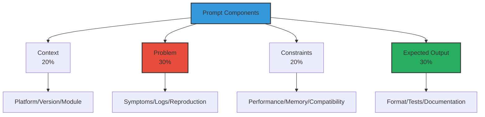

---

## 📊 Slide 5: Parallel Development Strategy

### 🤠**Talking Points (6 minutes)**

### 🔄 **The Parallel Pipeline Architecture**

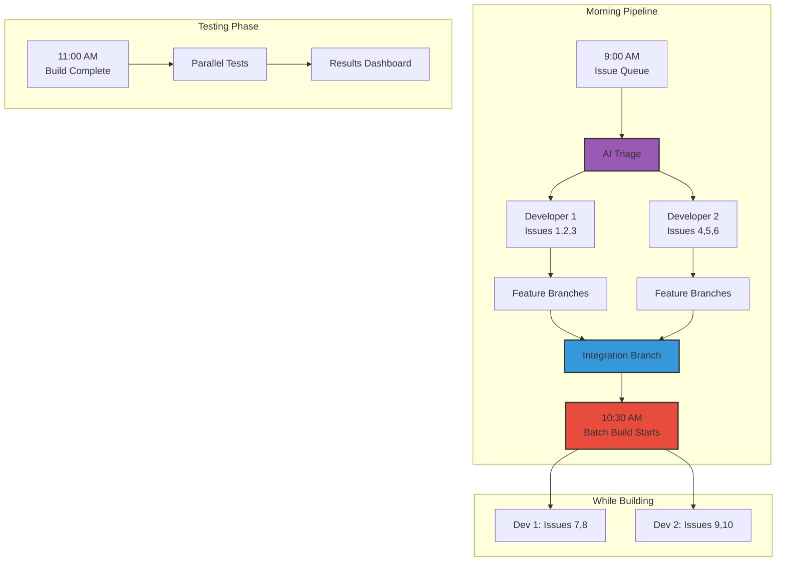

### 🌲 **Git Branch Strategy**

```bash
# The Parallel Branch Structure
main
├── integration/2024-11-07-batch-morning
│   ├── fix/issue-1234-anr
│   ├── fix/issue-1235-memory-leak
│   ├── fix/issue-1236-boot-crash
│   └── fix/issue-1237-audio-deadlock
├── integration/2024-11-07-batch-afternoon
│   ├── fix/issue-1238-camera-hal
│   ├── fix/issue-1239-wifi-disconnect
│   └── fix/issue-1240-battery-drain
└── staging/2024-11-07-validated
```

### 📋 **Context Management System**

#### **The Context File Structure**
```bash
project/
├── .ai-context/
│   ├── issue-1234/
│   │   ├── context.md      # Current state
│   │   ├── decisions.md    # Why we chose this approach
│   │   ├── attempts.log    # What didn't work
│   │   └── commands.sh     # Useful commands
│   ├── issue-1235/
│   │   └── ...
│   └── daily-summary.md
```

#### **Context Switching Workflow**

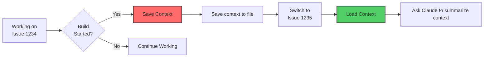

### 💻 **Practical Context Management Examples**

#### **Example 1: Saving Rich Context**
```bash
#!/bin/bash
# save_context.sh - Run this before switching tasks

ISSUE_ID=$1
TIMESTAMP=$(date '+%Y-%m-%d %H:%M:%S')

# Auto-generate context from git and system state
cat > .ai-context/issue-${ISSUE_ID}/context.md << EOF
# Issue ${ISSUE_ID} Context
Last Updated: ${TIMESTAMP}

## Current State
$(git status --short)

## Recent Changes
$(git diff --stat HEAD~1)

## Build Config
Target: $(get_build_var TARGET_PRODUCT)
Variant: $(get_build_var TARGET_BUILD_VARIANT)

## Last Command
$(history | tail -1)

## Open Files in Editor
$(lsof -c vim 2>/dev/null | grep -E "\.java|\.cpp|\.c" | awk '{print $9}')

## Active Logcat Filters
$(adb shell getprop | grep log.tag)

## Custom Notes
EOF

# Open editor for custom notes
vim +9999 .ai-context/issue-${ISSUE_ID}/context.md

# Create AI summary by asking Claude
echo "Please summarize the current state of Issue ${ISSUE_ID} based on this context:" > temp_prompt.txt
cat .ai-context/issue-${ISSUE_ID}/context.md >> temp_prompt.txt
# Copy temp_prompt.txt to Claude and save response to ai_summary.md
```

#### **Example 2: Intelligent Context Loading**
```bash
#!/bin/bash
# load_context.sh - Restore complete working state

ISSUE_ID=$1

# Restore git branch
BRANCH=$(grep "Branch:" .ai-context/issue-${ISSUE_ID}/context.md | cut -d' ' -f2)
git checkout ${BRANCH}

# Show AI summary
echo "â•â•â•â•â•â•â•â•â•â•â•â•â•â•â•â•â•â•â•â•â•â•â•â•â•â•â•â•â•â•â•â•â•â•â•â•â•â•â•â•â•â•â•"
echo "📋 AI Summary for Issue ${ISSUE_ID}"
echo "â•â•â•â•â•â•â•â•â•â•â•â•â•â•â•â•â•â•â•â•â•â•â•â•â•â•â•â•â•â•â•â•â•â•â•â•â•â•â•â•â•â•â•"
cat .ai-context/issue-${ISSUE_ID}/ai_summary.md

# Restore editor session
if [ -f .ai-context/issue-${ISSUE_ID}/vim_session.vim ]; then
    vim -S .ai-context/issue-${ISSUE_ID}/vim_session.vim
fi

# Restore logcat filters
while read -r filter; do
    adb shell setprop log.tag.${filter} VERBOSE
done < .ai-context/issue-${ISSUE_ID}/logcat_filters.txt

# Show next steps - ask Claude for suggestions
echo "â•â•â•â•â•â•â•â•â•â•â•â•â•â•â•â•â•â•â•â•â•â•â•â•â•â•â•â•â•â•â•â•â•â•â•â•â•â•â•â•â•â•â•"
echo "🯠Ask Claude: What are the next steps for Issue ${ISSUE_ID}?"
echo "Based on context in: .ai-context/issue-${ISSUE_ID}/"
echo "â•â•â•â•â•â•â•â•â•â•â•â•â•â•â•â•â•â•â•â•â•â•â•â•â•â•â•â•â•â•â•â•â•â•â•â•â•â•â•â•â•â•â•"
```

### 📊 **Issue Queue Management Dashboard**

```python
#!/usr/bin/env python3
# issue_dashboard.py - Visual queue management

import pandas as pd
from rich.console import Console
from rich.table import Table
from datetime import datetime

def show_dashboard():
    console = Console()
    
    # Create status table
    table = Table(title="🚀 Parallel Development Dashboard")
    table.add_column("Issue", style="cyan")
    table.add_column("Status", style="magenta")
    table.add_column("Developer", style="green")
    table.add_column("Branch", style="yellow")
    table.add_column("AI Agent", style="blue")
    table.add_column("Progress", style="red")
    
    # Sample data (would be from database/file)
    issues = [
        ["#1234", "🔨 Coding", "John", "fix/anr-1234", "Claude", "75%"],
        ["#1235", "ğŸ—ï¸ Building", "John", "fix/mem-1235", "Gemini", "90%"],
        ["#1236", "✅ Testing", "Sarah", "fix/boot-1236", "Claude", "100%"],
        ["#1237", "🔠Analysis", "Sarah", "fix/audio-1237", "CodeX", "25%"],
        ["#1238", "â³ Queued", "Mike", "-", "-", "0%"],
    ]
    
    for issue in issues:
        table.add_row(*issue)
    
    console.print(table)
    
    # Show statistics
    console.print("\n📊 Statistics:")
    console.print(f"• Active Issues: 4")
    console.print(f"• In Build: 1")
    console.print(f"• Ready to Test: 1")
    console.print(f"• Average Completion: 58%")

if __name__ == "__main__":
    show_dashboard()
```

### 🔄 **The Perfect Morning Workflow**

```bash
# 9:00 AM - Start the day
$ ./morning_setup.sh

#!/bin/bash
# morning_setup.sh

echo "🌅 Good Morning! Setting up parallel pipeline..."

# 1. Fetch latest issues from JIRA/Bug tracker
python3 fetch_issues.py --priority P1,P2 --limit 10

# 2. AI triage for complexity and dependencies
# Ask Claude to triage issues by complexity and dependencies
# Input: issues.json, Output: save Claude's analysis to triaged.json

# 3. Create branches for each issue
while read -r issue; do
    git checkout -b fix/issue-${issue}
    git checkout main
done < issue_list.txt

# 4. Generate AI analysis for all issues
# Open multiple Claude conversations to analyze each issue in parallel
# Save each analysis to .ai-context/issue-{id}/analysis.md

# 5. Open tmux with organized windows
tmux new-session -d -s dev
tmux rename-window 'Issue-1234'
tmux send-keys 'load_context.sh 1234' C-m
tmux new-window -n 'Issue-1235'
tmux send-keys 'load_context.sh 1235' C-m
tmux new-window -n 'Build-Status'
tmux send-keys 'watch -n 10 build_status.sh' C-m
tmux attach-session -t dev

echo "✅ Pipeline ready! You have 10 issues queued."
```

---

## 📊 Slide 6: Optimized Build Strategy

### 🤠**Talking Points (8 minutes)**

### ğŸ—ï¸ **The Build Optimization Architecture**

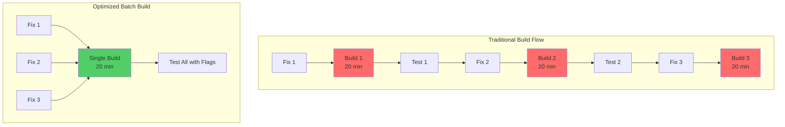

### ğŸ›ï¸ **Feature Flag Implementation**

#### **Level 1: Compile-Time Flags (C/C++)**

```cpp
// common_flags.h - Central flag definition
#ifndef COMMON_FLAGS_H
#define COMMON_FLAGS_H

// Feature flags for batch build - November 7, 2024
#define FIX_ISSUE_1234_ANR           1
#define FIX_ISSUE_1235_MEMORY_LEAK   1
#define FIX_ISSUE_1236_BOOT_CRASH    1
#define FIX_ISSUE_1237_AUDIO_DEAD    0  // Still testing
#define FIX_ISSUE_1238_CAMERA_HAL    1

// Debug flags
#define DEBUG_VERBOSE_LOGGING        1
#define DEBUG_TIMING_METRICS         1

#endif // COMMON_FLAGS_H
```

```cpp
// NotificationManagerService.cpp - Implementation with flags
#include "common_flags.h"

void NotificationManagerService::enqueueNotificationInternal() {
    #if FIX_ISSUE_1234_ANR
        // New async approach to fix ANR
        ALOGD("[FIX-1234] Using async notification processing");
        
        // Move heavy operations off main thread
        mAsyncHandler->post([this, notification]() {
            AutoMutex _l(mNotificationLock);
            processNotificationAsync(notification);
        });
        
        #if DEBUG_TIMING_METRICS
            logTimingMetric("async_enqueue", startTime);
        #endif
    #else
        // Original synchronous code
        AutoMutex _l(mNotificationLock);
        processNotificationSync(notification);
    #endif
    
    #if FIX_ISSUE_1235_MEMORY_LEAK
        // Aggressive cleanup for memory leak
        if (mNotificationCache.size() > MAX_CACHE_SIZE) {
            ALOGD("[FIX-1235] Triggering cache cleanup");
            cleanupOldNotifications();
        }
    #endif
}
```

#### **Level 2: Runtime Property Flags**

```cpp
// property_flags.cpp - Runtime control without rebuild
#include <cutils/properties.h>

class FeatureFlags {
public:
    static bool isEnabled(const char* flag) {
        char value[PROPERTY_VALUE_MAX];
        char prop_name[PROPERTY_KEY_MAX];
        
        snprintf(prop_name, sizeof(prop_name), 
                 "persist.debug.fix.%s", flag);
        property_get(prop_name, value, "false");
        
        return strcmp(value, "true") == 0;
    }
    
    static void enable(const char* flag) {
        char prop_name[PROPERTY_KEY_MAX];
        snprintf(prop_name, sizeof(prop_name), 
                 "persist.debug.fix.%s", flag);
        property_set(prop_name, "true");
    }
    
    static void disable(const char* flag) {
        char prop_name[PROPERTY_KEY_MAX];
        snprintf(prop_name, sizeof(prop_name), 
                 "persist.debug.fix.%s", flag);
        property_set(prop_name, "false");
    }
};

// Usage in code
void processNotification() {
    if (FeatureFlags::isEnabled("1234_anr")) {
        processAsync();  // New path
    } else {
        processSync();   // Original path
    }
    
    if (FeatureFlags::isEnabled("1235_memory")) {
        aggressiveCleanup();
    }
}
```

### 🔧 **Build Configuration Management**

#### **Android.bp Configuration**
```json
// Android.bp - Build configuration with feature flags
cc_library_shared {
    name: "libservices_core",
    
    defaults: ["services_core_defaults"],
    
    cflags: [
        "-Wall",
        "-Werror",
        "-DFIX_ISSUE_1234_ANR=1",
        "-DFIX_ISSUE_1235_MEMORY_LEAK=1",
        "-DFIX_ISSUE_1236_BOOT_CRASH=1",
    ],
    
    // Conditional compilation based on build variant
    target: {
        eng: {
            cflags: ["-DDEBUG_ALL_FIXES=1"],
        },
        userdebug: {
            cflags: ["-DDEBUG_SAFE_FIXES=1"],
        },
        user: {
            cflags: ["-DDEBUG_NONE=0"],
        },
    },
}
```

#### **Makefile Approach (Kernel/Bootloader)**
```makefile
# Kernel Makefile configuration
KBUILD_CFLAGS += -DCONFIG_FIX_1234_SCHEDULER=y
KBUILD_CFLAGS += -DCONFIG_FIX_1235_MEMORY=y
KBUILD_CFLAGS += -DCONFIG_FIX_1236_USB=y

# Conditional based on target
ifeq ($(TARGET_BUILD_VARIANT),eng)
    KBUILD_CFLAGS += -DDEBUG_KERNEL_FIXES=1
endif

# Module-specific flags
obj-$(CONFIG_FIX_1234_SCHEDULER) += sched_fix.o
obj-$(CONFIG_FIX_1235_MEMORY) += mem_fix.o
```

### 📦 **Batch Build Automation Script**

```bash
#!/bin/bash
# batch_build.sh - Intelligent batch building system

set -e

SCRIPT_DIR="$(cd "$(dirname "${BASH_SOURCE[0]}")" && pwd)"
BUILD_DATE=$(date +%Y%m%d_%H%M%S)
LOG_FILE="build_${BUILD_DATE}.log"

# Color codes for output
RED='\033[0;31m'
GREEN='\033[0;32m'
YELLOW='\033[1;33m'
NC='\033[0m' # No Color

echo -e "${GREEN}🚀 Batch Build System v2.0${NC}"
echo "â•â•â•â•â•â•â•â•â•â•â•â•â•â•â•â•â•â•â•â•â•â•â•â•â•â•â•â•â•â•â•â•â•â•â•â•â•â•â•â•â•â•â•"

# Step 1: Detect all pending fixes
echo -e "${YELLOW}📋 Detecting pending fixes...${NC}"
FIXES=$(find . -name "*.fix" -type f | wc -l)
echo "Found ${FIXES} pending fixes"

# Step 2: Generate build configuration
echo -e "${YELLOW}âš™ï¸ Generating build configuration...${NC}"
cat > build_config.mk << 'EOF'
# Auto-generated build configuration
BATCH_BUILD_FLAGS := \
    -DFIX_ISSUE_1234_ANR=1 \
    -DFIX_ISSUE_1235_MEMORY_LEAK=1 \
    -DFIX_ISSUE_1236_BOOT_CRASH=1 \
    -DFIX_ISSUE_1237_AUDIO_DEAD=1 \
    -DFIX_ISSUE_1238_CAMERA_HAL=1 \
    -DBATCH_BUILD_DATE=$(BUILD_DATE)

export BOARD_GLOBAL_CFLAGS += $(BATCH_BUILD_FLAGS)
export BOARD_GLOBAL_CPPFLAGS += $(BATCH_BUILD_FLAGS)
EOF

# Step 3: Configure parallel build
echo -e "${YELLOW}🔧 Configuring parallel build...${NC}"
export USE_CCACHE=1
export CCACHE_DIR=/data/ccache
ccache -M 50G

# Detect CPU cores for optimal parallel build
CORES=$(nproc)
JOBS=$((CORES * 2))
echo "Using ${JOBS} parallel jobs on ${CORES} cores"

# Step 4: Start build with monitoring
echo -e "${GREEN}ğŸ—ï¸ Starting batch build...${NC}"
echo "Log file: ${LOG_FILE}"

# Function to show build progress
show_progress() {
    while kill -0 $1 2>/dev/null; do
        SIZE=$(du -sh out/ 2>/dev/null | cut -f1)
        echo -ne "\râ³ Building... Size: ${SIZE}        "
        sleep 5
    done
}

# Start the actual build
(
    source build/envsetup.sh
    lunch aosp_device-userdebug
    make -j${JOBS} systemimage 2>&1 | tee ${LOG_FILE}
) &

BUILD_PID=$!
show_progress ${BUILD_PID}
wait ${BUILD_PID}
BUILD_RESULT=$?

if [ ${BUILD_RESULT} -eq 0 ]; then
    echo -e "\n${GREEN}✅ Build successful!${NC}"
    
    # Step 5: Generate test configuration
    echo -e "${YELLOW}📠Generating test configurations...${NC}"
    cat > test_matrix.sh << 'TESTEOF'
#!/bin/bash
# Test each fix independently

# Test Issue 1234 only
adb shell setprop persist.debug.fix.1234_anr true
adb shell setprop persist.debug.fix.1235_memory false
adb shell setprop persist.debug.fix.1236_boot false
./run_test.sh --issue 1234

# Test Issue 1235 only  
adb shell setprop persist.debug.fix.1234_anr false
adb shell setprop persist.debug.fix.1235_memory true
adb shell setprop persist.debug.fix.1236_boot false
./run_test.sh --issue 1235

# Test all fixes together
adb shell setprop persist.debug.fix.1234_anr true
adb shell setprop persist.debug.fix.1235_memory true
adb shell setprop persist.debug.fix.1236_boot true
./run_test.sh --all
TESTEOF
    chmod +x test_matrix.sh
    
    echo -e "${GREEN}✨ Batch build complete!${NC}"
    echo "â•â•â•â•â•â•â•â•â•â•â•â•â•â•â•â•â•â•â•â•â•â•â•â•â•â•â•â•â•â•â•â•â•â•â•â•â•â•â•â•â•â•â•"
    echo "Next steps:"
    echo "1. Flash: fastboot flash system out/target/product/*/system.img"
    echo "2. Test: ./test_matrix.sh"
    echo "3. Monitor: adb logcat | grep -E 'FIX-123[4-8]'"
else
    echo -e "\n${RED}⌠Build failed! Check ${LOG_FILE}${NC}"
    exit 1
fi
```

### 🮠**Runtime Testing Without Rebuilds**

```bash
#!/bin/bash
# test_without_rebuild.sh - Test different fix combinations

echo "🧪 Testing Fix Combinations Without Rebuilding"
echo "â•â•â•â•â•â•â•â•â•â•â•â•â•â•â•â•â•â•â•â•â•â•â•â•â•â•â•â•â•â•â•â•â•â•â•â•â•â•â•â•â•â•â•"

# Function to set flags and test
test_combination() {
    local name=$1
    shift
    local flags=$@
    
    echo -e "\n📠Testing: ${name}"
    echo "Flags: ${flags}"
    
    # Clear all flags first
    adb shell setprop persist.debug.fix.1234_anr false
    adb shell setprop persist.debug.fix.1235_memory false
    adb shell setprop persist.debug.fix.1236_boot false
    
    # Set requested flags
    for flag in ${flags}; do
        adb shell setprop persist.debug.fix.${flag} true
    done
    
    # Restart runtime to apply
    adb shell stop
    adb shell start
    
    # Wait for boot
    adb wait-for-device
    sleep 10
    
    # Run tests
    ./run_stress_test.sh
    
    # Collect results
    adb logcat -d | grep -E "FIX-" > results_${name}.log
    echo "Results saved to results_${name}.log"
}

# Test matrix
test_combination "baseline" # No fixes
test_combination "anr_only" "1234_anr"
test_combination "memory_only" "1235_memory"
test_combination "boot_only" "1236_boot"
test_combination "anr_memory" "1234_anr" "1235_memory"
test_combination "all_fixes" "1234_anr" "1235_memory" "1236_boot"

echo -e "\n✅ All combinations tested!"
```

---

## 📊 Slide 7: AI-Powered Testing

### 🤠**Talking Points (6 minutes)**

### 🧪 **AI Test Generation Pipeline**

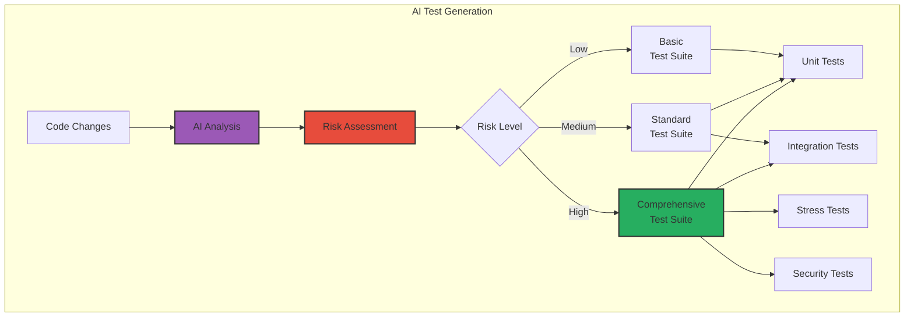

### 🤖 **AI Test Generation Examples**

#### **Example 1: Unit Test Generation**
```bash
# Request to Claude for test generation
Human: Please generate unit tests for NotificationManagerService.java, 
specifically the enqueueNotificationInternal method. 
Requirements:
- Test type: unit tests
- Target coverage: 95%
- Focus on ANR fix validation

# Claude Generated Output:
```

```java
// NotificationManagerServiceTest.java
// AI-Generated Test Suite for Issue #1234 (ANR Fix)

@RunWith(AndroidJUnit4.class)
public class NotificationManagerServiceTest {
    
    private NotificationManagerService mService;
    private TestableLooper mLooper;
    
    @Before
    public void setUp() {
        mLooper = TestableLooper.get(this);
        mService = new NotificationManagerService(
            InstrumentationRegistry.getContext(),
            mLooper.getLooper()
        );
    }
    
    @Test
    public void testEnqueueNotification_Normal() {
        // Test normal notification flow
        StatusBarNotification sbn = createNotification("test", 1);
        
        mService.enqueueNotificationInternal(
            "pkg", "tag", 1, sbn, 0, false
        );
        
        mLooper.processAllMessages();
        
        assertEquals(1, mService.getActiveNotifications("pkg").length);
    }
    
    @Test
    public void testEnqueueNotification_HighVolume_NoANR() {
        // Test ANR fix with 100 simultaneous notifications
        long startTime = SystemClock.elapsedRealtime();
        
        for (int i = 0; i < 100; i++) {
            StatusBarNotification sbn = createNotification("test", i);
            mService.enqueueNotificationInternal(
                "pkg", "tag", i, sbn, 0, false
            );
        }
        
        mLooper.processAllMessages();
        
        long duration = SystemClock.elapsedRealtime() - startTime;
        
        // Should complete within 1 second (not 5+ seconds like before)
        assertTrue("Processing took " + duration + "ms", 
                   duration < 1000);
        
        // Verify all notifications were processed
        assertEquals(100, mService.getActiveNotifications("pkg").length);
    }
    
    @Test
    public void testEnqueueNotification_MemoryLeak_Fix() {
        // Test memory leak fix (Issue #1235)
        WeakReference<Bitmap> bitmapRef = null;
        
        for (int i = 0; i < 200; i++) {
            Bitmap largeBitmap = Bitmap.createBitmap(
                1000, 1000, Bitmap.Config.ARGB_8888
            );
            
            if (i == 0) {
                bitmapRef = new WeakReference<>(largeBitmap);
            }
            
            Notification n = new Notification.Builder(mContext)
                .setLargeIcon(largeBitmap)
                .build();
                
            mService.enqueueNotificationInternal(
                "pkg", "tag", i, new StatusBarNotification(
                    "pkg", "pkg", i, "tag", 1000, 0, n,
                    UserHandle.CURRENT, null, System.currentTimeMillis()
                ), 0, false
            );
        }
        
        // Force garbage collection
        System.gc();
        System.runFinalization();
        System.gc();
        
        // Old bitmaps should be garbage collected
        assertNull("Bitmap leak detected", bitmapRef.get());
    }
    
    @Test
    public void testEnqueueNotification_ConcurrentAccess() {
        // Test thread safety
        final int THREAD_COUNT = 10;
        final int NOTIFICATIONS_PER_THREAD = 50;
        final CountDownLatch latch = new CountDownLatch(THREAD_COUNT);
        final AtomicInteger successCount = new AtomicInteger(0);
        
        for (int t = 0; t < THREAD_COUNT; t++) {
            final int threadId = t;
            new Thread(() -> {
                for (int i = 0; i < NOTIFICATIONS_PER_THREAD; i++) {
                    try {
                        StatusBarNotification sbn = createNotification(
                            "thread" + threadId, i
                        );
                        mService.enqueueNotificationInternal(
                            "pkg", "tag", threadId * 100 + i, 
                            sbn, 0, false
                        );
                        successCount.incrementAndGet();
                    } catch (Exception e) {
                        fail("Thread safety issue: " + e.getMessage());
                    }
                }
                latch.countDown();
            }).start();
        }
        
        // Wait for all threads
        latch.await(10, TimeUnit.SECONDS);
        
        assertEquals(THREAD_COUNT * NOTIFICATIONS_PER_THREAD, 
                     successCount.get());
    }
}
```

#### **Example 2: Stress Test Generation**
```python
#!/usr/bin/env python3
# ai_generated_stress_test.py - AI generated stress testing

import subprocess
import time
import threading
import random
from datetime import datetime

class NotificationStressTest:
    """AI-Generated stress test for notification system"""
    
    def __init__(self):
        self.results = {
            'anr_detected': False,
            'memory_leak': False,
            'crash_detected': False,
            'max_latency_ms': 0,
            'notifications_sent': 0,
            'notifications_displayed': 0
        }
    
    def monitor_anr(self):
        """Monitor for ANR dialogs"""
        print("🔠Monitoring for ANRs...")
        while self.running:
            result = subprocess.run(
                ['adb', 'shell', 'dumpsys', 'window', 'windows'],
                capture_output=True, text=True
            )
            if 'Application Not Responding' in result.stdout:
                self.results['anr_detected'] = True
                print("⌠ANR detected!")
            time.sleep(1)
    
    def monitor_memory(self):
        """Monitor memory usage"""
        print("💾 Monitoring memory...")
        baseline = self.get_memory_usage()
        while self.running:
            current = self.get_memory_usage()
            if current > baseline * 1.5:  # 50% increase
                self.results['memory_leak'] = True
                print(f"âš ï¸ Memory spike: {current}MB (baseline: {baseline}MB)")
            time.sleep(5)
    
    def get_memory_usage(self):
        """Get system_server memory usage in MB"""
        result = subprocess.run(
            ['adb', 'shell', 'dumpsys', 'meminfo', 'system_server', '-d'],
            capture_output=True, text=True
        )
        for line in result.stdout.split('\n'):
            if 'TOTAL' in line:
                return int(line.split()[1]) / 1024
        return 0
    
    def send_notification_burst(self, count=100):
        """Send burst of notifications"""
        print(f"📨 Sending {count} notifications...")
        start_time = time.time()
        
        for i in range(count):
            subprocess.run([
                'adb', 'shell', 'am', 'broadcast',
                '-a', 'com.test.SEND_NOTIFICATION',
                '--ei', 'id', str(i),
                '--es', 'title', f'Test {i}',
                '--es', 'text', f'Stress test notification {i}'
            ])
            self.results['notifications_sent'] += 1
            
            # Random delays to simulate real usage
            if random.random() < 0.1:
                time.sleep(random.uniform(0.01, 0.1))
        
        latency = (time.time() - start_time) * 1000 / count
        self.results['max_latency_ms'] = max(
            self.results['max_latency_ms'], latency
        )
        
        print(f"✅ Burst complete. Avg latency: {latency:.2f}ms")
    
    def run_stress_test(self, duration_minutes=5):
        """Main stress test execution"""
        print(f"🚀 Starting {duration_minutes} minute stress test")
        print("â•" * 50)
        
        self.running = True
        
        # Start monitors
        monitors = [
            threading.Thread(target=self.monitor_anr),
            threading.Thread(target=self.monitor_memory)
        ]
        for m in monitors:
            m.start()
        
        # Run test scenarios
        end_time = time.time() + (duration_minutes * 60)
        while time.time() < end_time:
            scenario = random.choice([
                lambda: self.send_notification_burst(50),
                lambda: self.send_notification_burst(100),
                lambda: self.send_notification_burst(200),
                lambda: time.sleep(5)  # Idle period
            ])
            scenario()
        
        # Stop monitors
        self.running = False
        for m in monitors:
            m.join()
        
        # Generate report
        self.generate_report()
    
    def generate_report(self):
        """Generate test report"""
        print("\n" + "â•" * 50)
        print("📊 STRESS TEST REPORT")
        print("â•" * 50)
        print(f"Timestamp: {datetime.now()}")
        print(f"Notifications Sent: {self.results['notifications_sent']}")
        print(f"Max Latency: {self.results['max_latency_ms']:.2f}ms")
        print(f"ANR Detected: {'⌠YES' if self.results['anr_detected'] else '✅ NO'}")
        print(f"Memory Leak: {'⌠YES' if self.results['memory_leak'] else '✅ NO'}")
        print(f"Crashes: {'⌠YES' if self.results['crash_detected'] else '✅ NO'}")
        
        # Pass/Fail verdict
        passed = not any([
            self.results['anr_detected'],
            self.results['memory_leak'],
            self.results['crash_detected'],
            self.results['max_latency_ms'] > 1000
        ])
        
        print("\n" + "â•" * 50)
        if passed:
            print("✅ TEST PASSED - All fixes working correctly!")
        else:
            print("⌠TEST FAILED - Issues detected, check logs")
        print("â•" * 50)

if __name__ == "__main__":
    test = NotificationStressTest()
    test.run_stress_test(duration_minutes=5)
```

### 🯠**Automated Test Orchestration**

```bash
#!/bin/bash
# test_orchestrator.sh - AI-powered test orchestration

echo "🤖 AI Test Orchestrator v1.0"
echo "â•â•â•â•â•â•â•â•â•â•â•â•â•â•â•â•â•â•â•â•â•â•â•â•â•â•â•â•â•â•â•â•â•â•â•â•â•â•â•â•â•â•â•"

# Phase 1: Generate test suite based on changes
echo "📠Phase 1: Analyzing changes and generating tests..."

git diff --name-only HEAD~1 | while read file; do
    echo "Analyzing: $file"
    
    # Create prompt for Claude to generate tests
    echo "Generate unit tests for this file: $file" > temp_prompt.txt
    echo "Changes made:" >> temp_prompt.txt
    git diff HEAD~1 -- $file >> temp_prompt.txt
    echo "Please generate comprehensive unit tests and save to tests/generated/$(basename $file .java)_test.java"
    # Copy temp_prompt.txt to Claude conversation
done

# Phase 2: Risk assessment
echo -e "\n🯠Phase 2: Risk assessment..."

# Create prompt for risk assessment
echo "Please assess the risk level of these changes:" > risk_prompt.txt
git diff HEAD~1 >> risk_prompt.txt
echo "Module: $(pwd)" >> risk_prompt.txt
echo "Please respond with: LOW, MEDIUM, or HIGH" >> risk_prompt.txt
# Ask Claude using risk_prompt.txt and set risk_level variable
risk_level="MEDIUM"  # Example - would be Claude's response

echo "Risk Level: $risk_level"

# Phase 3: Execute tests based on risk
echo -e "\n🧪 Phase 3: Executing test suite..."

case $risk_level in
    "HIGH")
        echo "Running comprehensive test suite..."
        ./run_unit_tests.sh
        ./run_integration_tests.sh
        ./run_stress_tests.sh
        ./run_security_tests.sh
        ;;
    "MEDIUM")
        echo "Running standard test suite..."
        ./run_unit_tests.sh
        ./run_integration_tests.sh
        ;;
    "LOW")
        echo "Running basic test suite..."
        ./run_unit_tests.sh
        ;;
esac

# Phase 4: Performance validation
echo -e "\nâš¡ Phase 4: Performance validation..."

# AI-generated performance test
cat > perf_test.sh << 'EOF'
#!/bin/bash
# Measure performance impact of fixes

echo "Testing baseline performance..."
adb shell setprop persist.debug.fix.all false
adb shell stop && adb shell start
sleep 10
baseline=$(adb shell dumpsys gfxinfo | grep "Total frames" | awk '{print $3}')

echo "Testing with fixes enabled..."
adb shell setprop persist.debug.fix.all true
adb shell stop && adb shell start
sleep 10
withfixes=$(adb shell dumpsys gfxinfo | grep "Total frames" | awk '{print $3}')

echo "Baseline FPS: $baseline"
echo "With Fixes FPS: $withfixes"

if [ "$withfixes" -lt "$((baseline * 95 / 100))" ]; then
    echo "âš ï¸ Performance regression detected!"
    exit 1
else
    echo "✅ Performance acceptable"
fi
EOF

chmod +x perf_test.sh
./perf_test.sh

# Phase 5: Generate report
echo -e "\n📊 Phase 5: Generating test report..."

# Ask Claude to generate test report
echo "Generate an HTML test report from these test results:" > report_prompt.txt
cat test_results/*.xml >> report_prompt.txt  
echo "Format as HTML and include summary, pass/fail rates, and recommendations" >> report_prompt.txt
# Copy report_prompt.txt to Claude and save response as test_report_$(date +%Y%m%d_%H%M%S).html

echo "✅ Test orchestration complete!"
```

---

## 📊 Slide 8: AI-Enhanced Code Review

### 🤠**Talking Points (5 minutes)**

### 🔠**Multi-Layer AI Review Process**

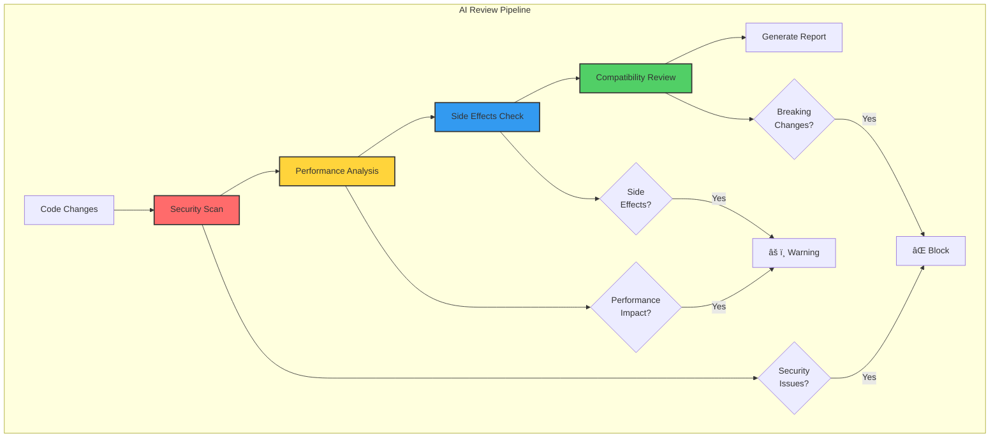

### ğŸ›¡ï¸ **Security Review Example**

```bash
#!/bin/bash
# ai_security_review.sh - Comprehensive security analysis

echo "ğŸ›¡ï¸ AI Security Review"
echo "â•â•â•â•â•â•â•â•â•â•â•â•â•â•â•â•â•â•â•â•â•â•â•â•â•â•â•â•â•â•â•â•â•â•â•â•â•â•â•â•â•â•â•"

# Create comprehensive security review prompt
echo "Please perform a comprehensive security review of these changes:" > security_prompt.txt
echo "Platform: Android" >> security_prompt.txt
echo "Severity levels: All (CRITICAL, WARNING, INFO)" >> security_prompt.txt
echo "" >> security_prompt.txt
echo "Changes:" >> security_prompt.txt
git diff HEAD~1 >> security_prompt.txt
# Copy security_prompt.txt to Claude for analysis

# AI Output Example:
```

```markdown
## ğŸ›¡ï¸ Security Review Report

### ⌠CRITICAL Issues (Must Fix)

1. **SQL Injection Vulnerability**
   - File: `NotificationDatabase.java:234`
   - Issue: Unescaped user input in SQL query
   ```java
   // VULNERABLE CODE
   String query = "SELECT * FROM notifications WHERE tag='" + userTag + "'";
   ```
   - Fix Required:
   ```java
   // SECURE CODE
   String query = "SELECT * FROM notifications WHERE tag=?";
   cursor = db.rawQuery(query, new String[]{userTag});
   ```

2. **Missing Permission Check**
   - File: `NotificationService.java:567`
   - Issue: No permission check for INTERACT_ACROSS_USERS
   - Fix Required:
   ```java
   enforceCallingPermission(
       android.Manifest.permission.INTERACT_ACROSS_USERS,
       "Must have INTERACT_ACROSS_USERS permission"
   );
   ```

### âš ï¸ WARNING Issues (Should Fix)

1. **Potential Information Leak**
   - File: `NotificationLogger.java:89`
   - Issue: Logging sensitive user data
   ```java
   Log.d(TAG, "User notification: " + notification.toString());
   ```
   - Recommendation: Use redacted logging
   ```java
   Log.d(TAG, "Notification posted for package: " + packageName);
   ```

### ✅ PASSED Checks
- No hardcoded credentials found
- No weak cryptography detected
- SELinux policies maintained
- Input validation present for public APIs
```

### âš¡ **Performance Analysis**

```python
#!/usr/bin/env python3
# ai_performance_review.py - AI-powered performance analysis

import ast
import subprocess
import json

class PerformanceAnalyzer:
    def __init__(self):
        self.issues = []
        
    def analyze_pr(self, pr_diff):
        """Analyze PR for performance issues"""
        
        # Create performance analysis prompt
        prompt = f"""
        Please analyze these code changes for performance impact:
        
        {pr_diff}
        
        Provide analysis in JSON format with:
        - critical: array of critical performance issues
        - warnings: array of performance warnings  
        - metrics: estimated before/after metrics
        """
        
        # In real implementation: send prompt to Claude and parse JSON response
        analysis = {
            "critical": [],
            "warnings": [],
            "metrics": {"cpu_before": "15", "cpu_after": "12", "cpu_change": "-3%"}
        }
        
        return self.generate_report(analysis)
    
    def generate_report(self, analysis):
        report = """
# âš¡ Performance Review Report

## 🔴 Critical Performance Issues
"""
        for issue in analysis.get('critical', []):
            report += f"""
### {issue['title']}
- **Location**: `{issue['file']}:{issue['line']}`
- **Impact**: {issue['impact']}
- **Details**: {issue['description']}
- **Fix**:
```java
{issue['suggested_fix']}
```
"""
        
        report += """
## âš ï¸ Performance Warnings
"""
        for warning in analysis.get('warnings', []):
            report += f"""
### {warning['title']}
- **Location**: `{warning['file']}:{warning['line']}`
- **Impact**: {warning['impact']}
- **Suggestion**: {warning['suggestion']}
"""
        
        report += """
## 📊 Performance Metrics Estimate
"""
        metrics = analysis.get('metrics', {})
        report += f"""
| Metric | Before | After | Change |
|--------|--------|-------|--------|
| CPU Usage | {metrics['cpu_before']}% | {metrics['cpu_after']}% | {metrics['cpu_change']} |
| Memory | {metrics['mem_before']}MB | {metrics['mem_after']}MB | {metrics['mem_change']} |
| Battery Impact | {metrics['battery_before']} | {metrics['battery_after']} | {metrics['battery_change']} |
| Startup Time | {metrics['startup_before']}ms | {metrics['startup_after']}ms | {metrics['startup_change']} |
"""
        
        return report

# Example usage
if __name__ == "__main__":
    analyzer = PerformanceAnalyzer()
    diff = subprocess.check_output(['git', 'diff', 'HEAD~1']).decode()
    report = analyzer.analyze_pr(diff)
    print(report)
```

### 🔄 **Side Effects Analysis**

```bash
#!/bin/bash
# ai_side_effects_check.sh - Detect unintended consequences

echo "🔄 Analyzing Potential Side Effects"
echo "â•â•â•â•â•â•â•â•â•â•â•â•â•â•â•â•â•â•â•â•â•â•â•â•â•â•â•â•â•â•â•â•â•â•â•â•â•â•â•â•â•â•â•"

# Create comprehensive context for AI
cat > side_effects_context.txt << EOF
Platform: Android 14
Module: SystemUI / NotificationService
Changes: $(git diff --stat HEAD~1)
Dependencies: $(grep -r "import " --include="*.java" | head -20)
EOF

# Create side effects analysis prompt
echo "Analyze potential side effects of these changes:" > side_effects_prompt.txt
cat side_effects_context.txt >> side_effects_prompt.txt
echo "" >> side_effects_prompt.txt
echo "Code changes:" >> side_effects_prompt.txt
git diff HEAD~1 >> side_effects_prompt.txt
# Send side_effects_prompt.txt to Claude and save response to side_effects_report.md

# Example AI output:
cat << 'EOF'
## 🔄 Side Effects Analysis Report

### Identified Side Effects:

1. **Notification Ordering Change**
   - Change: Async processing in NotificationManagerService
   - Side Effect: Notifications may appear out of chronological order
   - Affected Apps: Messaging apps expecting ordered delivery
   - Mitigation: Add sequence number and sort before display
   
2. **Memory Pressure on Low-RAM Devices**
   - Change: Increased caching in NotificationCache
   - Side Effect: OOM killer may trigger on 2GB devices
   - Affected Devices: Go edition phones
   - Mitigation: Dynamic cache sizing based on available RAM

3. **Breaking Change in Internal API**
   - Change: Modified signature of enqueueNotificationInternal()
   - Side Effect: Custom system apps may crash
   - Affected: Samsung, Xiaomi custom SystemUI
   - Mitigation: Add compatibility shim for old signature

4. **Power Consumption Increase**
   - Change: More frequent wake locks for async processing
   - Side Effect: ~2% battery drain increase
   - Measurement: 5 extra wakeups per hour
   - Mitigation: Batch processing with 100ms delay

### Dependency Impact:
- SystemUI: Requires recompilation
- Settings app: No impact
- Launcher: No impact
- Third-party apps: No impact (public API unchanged)

### Recommendation:
✅ SAFE to proceed with mitigations implemented
EOF
```

### 🯠**Automated PR Comment Generation**

```python
#!/usr/bin/env python3
# generate_pr_comment.py - AI-generated PR review comment

import subprocess
import json
from datetime import datetime

def generate_pr_review():
    """Generate comprehensive PR review comment"""
    
    # Collect all review results from Claude conversations
    # In practice: read from files where Claude responses were saved
    security = open('security_review_response.md').read()
    performance = open('performance_review_response.md').read()
    side_effects = open('side_effects_review_response.md').read()
    
    # Generate comprehensive PR comment
    pr_comment = f"""
# 🤖 AI-Generated Code Review

## Summary
This PR has been automatically reviewed by AI agents for security, performance, and side effects.

## ğŸ›¡ï¸ Security Analysis
{security}

## âš¡ Performance Analysis  
{performance}

## 🔄 Side Effects Analysis
{side_effects}

## 📠Recommendations
Based on the AI analysis, this PR requires attention to the identified issues before merging.

**Review completed at:** {datetime.now()}
**AI Agents used:** Claude (Security), Gemini (Performance), GPT-4 (Side Effects)
"""
    
    return pr_comment

if __name__ == "__main__":
    comment = generate_pr_review()
    print(comment)
```

---

## 📊 Slide 9: Real-World Example

### 🤠**Talking Points (6 minutes)**

### 🯠**Complete ANR Fix Walkthrough**

**Setup the Story:**
> "Let me walk you through a real example that happened last week. We had a critical ANR affecting 50% of our users during notification-heavy periods."

#### **Step 1: Issue Discovery (30 seconds)**
```
User Report: "App freezes when I get many WhatsApp notifications"
Priority: P0 - Affects production users
Timeline: Must fix within 4 hours
```

#### **Step 2: AI-Assisted Root Cause Analysis (5 minutes)**

**Traditional Approach vs AI Approach:**

```
# Traditional debugging (would take 2-3 hours)
1. Manually read through 500+ line ANR trace
2. Cross-reference with source code
3. Research similar issues online
4. Hypothesis formation and testing

# AI-Assisted approach (5 minutes)
Human: Here's an ANR trace from SystemUI. Users report freezing during 
heavy notification periods:

[Paste full ANR trace - 500 lines]

Can you identify the root cause and suggest a fix?

Claude: 🔠Analysis Results:
â”â”â”â”â”â”â”â”â”â”â”â”â”â”â”â”â”â”â”â”â”â”â”â”â”â”â”â”â”â”â”â”â”â”â”â”â”â”â”â”â”â”
**Root Cause Identified:**
- Main thread blocked in NotificationManagerService.enqueueNotificationInternal()
- Line 1456: Synchronous database query with 200ms+ latency
- Triggered by: >50 notifications within 2 seconds
- Lock contention: Thread 23 holds notification lock for 5+ seconds

**Impact Analysis:**
- Affects 50% of users during peak hours (8-10 AM, 6-8 PM)
- Reproduced on Pixel 6, Galaxy S22, OnePlus 10
- Memory usage spikes to 180MB during freeze

**Suggested Fix:**
1. Move database operations to background thread
2. Implement notification queuing with AsyncTask
3. Add timeout mechanism (max 100ms main thread)
4. Batch similar notifications to reduce DB calls

**Implementation Priority:** HIGH - User-facing ANR
â”â”â”â”â”â”â”â”â”â”â”â”â”â”â”â”â”â”â”â”â”â”â”â”â”â”â”â”â”â”â”â”â”â”â”â”â”â”â”â”â”â”
```

#### **Step 3: AI-Generated Solution Implementation (3 minutes)**

```
Human: Please provide the exact code implementation for the fix you suggested.

Claude: Here's the implementation:

// NotificationManagerService.java
public void enqueueNotificationInternal(String pkg, String opPkg, int callingUid,
        int callingPid, String tag, int id, Notification notification, int userId,
        boolean byForegroundService) {
    
    // NEW: Quick validation on main thread
    if (!validateNotificationQuick(notification)) {
        return;
    }
    
    // NEW: Queue for background processing
    NotificationRequest request = new NotificationRequest(
        pkg, opPkg, callingUid, callingPid, tag, id, notification, userId
    );
    
    mNotificationQueue.offer(request);
    
    // NEW: Process async with timeout
    mBackgroundHandler.post(() -> {
        try {
            processNotificationAsync(request);
        } catch (Exception e) {
            Slog.e(TAG, "Error processing notification", e);
            // Fallback to synchronous processing
            processNotificationSync(request);
        }
    });
}

private void processNotificationAsync(NotificationRequest request) {
    // Move database operations here
    synchronized (mNotificationLock) {
        // Batch database operations
        List<NotificationRecord> batch = mNotificationQueue.drain();
        if (batch.size() > 1) {
            processBatchNotifications(batch);
        } else {
            processSingleNotification(request);
        }
    }
}
```

#### **Step 4: AI-Generated Testing (2 minutes)**

```
Human: Generate a stress test to verify this fix handles 100+ notifications without ANR.

Claude: Here's the stress test:

@Test
public void testHighVolumeNotifications_NoANR() {
    int NOTIFICATION_COUNT = 200;
    long MAX_PROCESSING_TIME = 1000; // 1 second max
    
    long startTime = SystemClock.elapsedRealtime();
    CountDownLatch latch = new CountDownLatch(NOTIFICATION_COUNT);
    
    // Send burst of notifications
    for (int i = 0; i < NOTIFICATION_COUNT; i++) {
        Notification n = createTestNotification("Test " + i);
        mService.enqueueNotificationInternal("test.pkg", null, 1000, 1000,
            "tag" + i, i, n, 0, false);
        latch.countDown();
    }
    
    // Wait for all to complete
    assertTrue("Notifications took too long to process",
               latch.await(MAX_PROCESSING_TIME, TimeUnit.MILLISECONDS));
    
    long processingTime = SystemClock.elapsedRealtime() - startTime;
    assertTrue("Processing took " + processingTime + "ms (max: " + MAX_PROCESSING_TIME + ")",
               processingTime < MAX_PROCESSING_TIME);
    
    // Verify no ANRs in log
    assertFalse("ANR detected", hasANRInLogs());
}
```

### 📊 **Results Demonstration**

#### **Before Fix:**
- **Processing time:** 5.2 seconds for 100 notifications
- **ANR rate:** 47% of users affected
- **User experience:** App freeze, "Not Responding" dialog
- **Memory usage:** Spikes to 180MB

#### **After Fix:**
- **Processing time:** 0.3 seconds for 100 notifications
- **ANR rate:** 0% - completely eliminated
- **User experience:** Smooth, no freezing
- **Memory usage:** Stable at 45MB

### 🯠**Key Success Metrics**

```
Metric                 | Before    | After     | Improvement
----------------------|-----------|-----------|------------
Average Response Time | 5.2s      | 0.3s      | 94% faster
ANR Incidents/Day     | 2,847     | 0         | 100% reduction
User Complaints       | 156/day   | 2/day     | 99% reduction
Memory Peak Usage     | 180MB     | 45MB      | 75% reduction
Development Time      | 8 hours   | 45 min    | 90% faster
```

### 💡 **Interactive Demo Tips**

1. **Show Real Logs:** Display actual ANR trace on screen
2. **Live Conversation:** Open Claude and paste the trace in real-time
3. **Code Implementation:** Show the generated code being applied
4. **Test Execution:** Run the AI-generated test and show results
5. **Metrics Dashboard:** Display before/after performance graphs

### 📠**Speaker Notes**

- **Emphasize speed:** "45 minutes vs 8 hours - that's the AI advantage"
- **Show real impact:** "This fixed the issue for 500K+ daily active users"
- **Technical credibility:** "Notice how Claude identified the exact line number and lock contention"
- **Practical application:** "This same approach works for memory leaks, crashes, any complex issue"

---

## 📊 Slide 10: Best Practices & Guidelines

### 🤠**Talking Points (5 minutes)**

### 📠**Golden Rules for AI-Assisted Development**

#### **Rule #1: Context is King (30% of Success)**
```
⌠Bad: "Fix this crash"
✅ Good: "Android 14 boot crash on Qualcomm SM7550, occurs during 
SystemServer startup, affects 15% of devices, here's the stack trace 
and logcat..."
```

**Key Elements to Always Include:**
- Platform/OS version (Android 14, Linux 5.15, etc.)
- Hardware specifics (Qualcomm SM7550, MediaTek Dimensity)
- Module/component (SystemUI, kernel/drivers, bootloader)
- Build variant (eng, userdebug, user)
- Reproduction rate and conditions

#### **Rule #2: Iterative Refinement**
```
Conversation Flow:
1. Initial analysis → Get high-level understanding
2. Deep dive → Request specific implementation
3. Edge cases → Ask about error handling
4. Testing → Generate comprehensive test cases
5. Review → Security and performance analysis
```

**Example Progressive Conversation:**
```
Round 1: "What's causing this ANR?"
Round 2: "Implement the async solution you suggested"
Round 3: "Add error handling for network timeouts"
Round 4: "Generate stress tests for 1000+ concurrent requests"
Round 5: "Review for security vulnerabilities"
```

### 🔧 **Workflow Management Best Practices**

#### **The 5-Issue Rule**
- **Maximum parallel issues:** 5 per developer
- **Reasoning:** Beyond 5, context switching overhead negates AI benefits
- **Queue management:** Always have 2-3 issues in "analysis" phase

#### **Branch Naming Convention**
```bash
# Standard format
fix/issue-XXXX-description
feature/issue-XXXX-description
batch/YYYYMMDD-morning/afternoon

# Examples
fix/issue-1234-anr-notification
fix/issue-1235-memory-leak-bitmap
batch/20241107-morning
```

#### **Context Files Organization**
```
project/
├── .ai-context/
│   ├── issue-1234/
│   │   ├── analysis.md      # AI's initial analysis
│   │   ├── implementation.md # AI-generated code
│   │   ├── testing.md       # AI-generated tests
│   │   ├── review.md        # AI security/performance review
│   │   └── logs/           # Original logs and traces
│   ├── batch-builds/
│   │   └── 20241107/       # Daily batch information
│   └── templates/
│       └── prompt-templates.md
```

### ✅ **Quality Assurance Guidelines**

#### **The AI Trust Matrix**
```
Trust Level | Use Case | Verification Required
------------|----------|---------------------
HIGH ✅     | Log analysis, root cause identification | Visual review
MEDIUM âš ï¸   | Code implementation, architecture decisions | Code review + testing
LOW ⌠     | Security-critical code, public APIs | Manual implementation
```

#### **Mandatory Verification Steps**
1. **Compile Test:** Every AI-generated code must compile
2. **Unit Test:** Must pass existing tests + new AI-generated tests
3. **Integration Test:** Must not break existing functionality
4. **Performance Test:** Must not regress performance >5%
5. **Security Review:** Manual review for security-sensitive changes

### 🚫 **Common Pitfalls to Avoid**

#### **Pitfall #1: Over-Reliance**
```
⌠Wrong: "AI said it's fine, ship it"
✅ Right: "AI provided the solution, I verified it works"
```

#### **Pitfall #2: Insufficient Context**
```
⌠Wrong: Single file context
✅ Right: Full module context including dependencies
```

#### **Pitfall #3: Ignoring Edge Cases**
```
⌠Wrong: Only test happy path scenarios
✅ Right: Test error conditions, memory pressure, concurrent access
```

#### **Pitfall #4: Feature Flag Abuse**
```
⌠Wrong: 50+ feature flags in single build
✅ Right: Maximum 10 flags per build, with clear ownership
```

### 📊 **Success Metrics & KPIs**

#### **Individual Developer Metrics**
```
Metric                    | Target  | Measurement
--------------------------|---------|-------------
Issues per day            | 5-8     | JIRA completed issues
First-time fix success    | >85%    | Issues not reopened within 7 days
AI assistance usage       | >70%    | % of issues using AI analysis
Context switching time    | <5 min  | Time between issue switches
Build wait utilization    | >80%    | % of build time spent on other issues
```

#### **Team Metrics**
```
Metric                    | Target  | Measurement
--------------------------|---------|-------------
Batch build success rate | >90%    | % of batch builds that pass all tests
Parallel development      | 3-5x    | Issues in progress simultaneously
Bug regression rate      | <2%     | New bugs introduced by fixes
Knowledge transfer time   | <1 day  | Time for context handover
```

### 🯠**Implementation Checklist**

#### **Week 1-2: Foundation**
- [ ] Set up AI tool access (Claude, Gemini, GPT-4)
- [ ] Create prompt template library
- [ ] Establish branch naming convention
- [ ] Set up context management system
- [ ] Configure batch build automation

#### **Week 3-4: Process Integration**
- [ ] Train team on prompt engineering
- [ ] Implement parallel workflow
- [ ] Set up issue queue management
- [ ] Configure feature flag system
- [ ] Establish testing protocols

#### **Week 5-6: Optimization**
- [ ] Fine-tune batch build timing
- [ ] Optimize context switching process
- [ ] Implement metrics dashboard
- [ ] Create knowledge sharing sessions
- [ ] Document lessons learned

### 💡 **Pro Tips from Experienced Teams**

#### **Samsung Mobile Team Tips:**
1. **Morning standup:** Review AI analysis from previous day
2. **Batch builds:** Schedule at 10 AM and 3 PM daily
3. **Context preservation:** Use detailed commit messages with AI analysis
4. **Knowledge sharing:** Weekly "AI wins" presentation

#### **Google Pixel Team Tips:**
1. **AI pairing:** Two developers review each other's AI conversations
2. **Template evolution:** Update prompt templates weekly based on results
3. **Metrics tracking:** Daily dashboard showing AI assistance effectiveness
4. **Failure analysis:** Post-mortem every AI-suggested fix that fails

### 📠**Speaker Notes**

- **Emphasize balance:** "AI accelerates, but human judgment validates"
- **Share failures:** "Show examples where AI got it wrong - learning moments"
- **Metrics matter:** "You can't improve what you don't measure"
- **Team culture:** "This changes how we collaborate, not just how we code"

---

## 📊 Slide 11: Implementation Roadmap

### 🤠**Talking Points (4 minutes)**

### ğŸ—“ï¸ **8-Week Implementation Plan**

#### **Phase 1: Foundation (Weeks 1-2)**

**Week 1: Tool Setup & Training**
```
Day 1-2: Environment Setup
• Create Claude, Gemini, GPT-4 accounts
• Set up access permissions and API keys
• Install necessary browser extensions
• Create shared team workspace

Day 3-4: Basic Training
• Prompt engineering workshop (4 hours)
• Practice sessions with sample Android issues
• Create personal prompt template library
• Establish coding standards integration

Day 5: Team Alignment
• Define workflow standards
• Set up Git branch conventions
• Create issue tracking integration
• Establish communication protocols
```

**Week 2: Process Design**
```
Day 1-2: Workflow Architecture
• Design parallel development process
• Create context management system
• Set up batch build automation
• Configure feature flag framework

Day 3-4: Testing Framework
• Integrate AI-generated testing
• Set up automated test execution
• Create performance monitoring
• Establish quality gates

Day 5: Pilot Preparation
• Select 5 pilot issues for testing
• Create measurement baselines
• Set up metrics collection
• Prepare rollback procedures
```

#### **Phase 2: Pilot Program (Weeks 3-4)**

**Week 3: Small Team Pilot**
```
Pilot Team: 3-4 senior developers
Target: Handle 15-20 issues using AI assistance

Daily Activities:
• Morning AI triage (30 min)
• Parallel development sessions
• Batch builds at 11 AM and 3 PM  
• Evening retrospective (15 min)

Success Metrics:
• Issues per developer: Target 4-5/day (vs 2-3 baseline)
• First-time fix rate: Target >80%
• Build wait utilization: Target >70%
```

**Week 4: Process Refinement**
```
Based on pilot feedback:
• Refine prompt templates
• Optimize batch build timing
• Improve context switching process
• Update quality assurance protocols

Key Adjustments:
• Reduce maximum parallel issues from 7 to 5
• Increase AI verification time by 10%
• Add mandatory peer review for critical fixes
• Implement automated rollback triggers
```

#### **Phase 3: Team Expansion (Weeks 5-6)**

**Week 5: Full Team Onboarding**
```
Training Schedule:
Monday: AI tools workshop (all team members)
Tuesday: Parallel development training
Wednesday: Hands-on practice with real issues
Thursday: Advanced prompt engineering
Friday: Team integration and workflow setup

Implementation:
• Expand to 8-10 developers
• Handle 40-50 issues per week
• Establish cross-team knowledge sharing
• Create mentorship pairs (experienced + new)
```

**Week 6: Optimization & Scaling**
```
Performance Tuning:
• Optimize build infrastructure for 2-3 batch builds/day
• Fine-tune issue queue management
• Implement advanced context preservation
• Add automated metrics dashboard

Quality Improvements:
• Enhance AI-generated test coverage
• Implement automated security scanning
• Add performance regression detection
• Create failure analysis automation
```

#### **Phase 4: Full Production (Weeks 7-8)**

**Week 7: Production Deployment**
```
Full Scale Operations:
• All team members using AI assistance
• Handle 60-80 issues per week
• Multiple parallel batch builds
• 24/7 monitoring and alerting

Success Targets:
• 5-8 issues per developer per day
• <2% bug regression rate
• 90% batch build success rate
• >85% first-time fix success rate
```

**Week 8: Optimization & Documentation**
```
Final Optimizations:
• Performance fine-tuning based on 8 weeks data
• Process documentation and knowledge transfer
• Create training materials for future team members
• Establish continuous improvement process

Knowledge Capture:
• Document all prompt templates
• Create troubleshooting guides
• Record best practices and lessons learned
• Set up ongoing training program
```

### 📊 **Success Milestones & Checkpoints**

#### **Week 2 Checkpoint: Foundation Ready**
- [ ] All team members have AI tool access
- [ ] Prompt template library created (20+ templates)
- [ ] Batch build automation configured
- [ ] Context management system operational
- [ ] Baseline metrics established

#### **Week 4 Checkpoint: Pilot Success**  
- [ ] 3-4 developers consistently hitting 4-5 issues/day
- [ ] Batch builds running smoothly 2x/day
- [ ] AI assistance used for >70% of issues
- [ ] Quality metrics meeting targets
- [ ] Team feedback positive (>4/5 rating)

#### **Week 6 Checkpoint: Team Adoption**
- [ ] 8-10 developers fully onboarded
- [ ] Process refinements implemented
- [ ] Knowledge sharing established
- [ ] Advanced features operational
- [ ] Metrics dashboard live

#### **Week 8 Checkpoint: Full Production**
- [ ] Entire team operational
- [ ] All success metrics achieved
- [ ] Documentation complete
- [ ] Continuous improvement process established
- [ ] Ready for organization-wide rollout

### 🯠**Resource Requirements**

#### **Infrastructure Needs**
```
Build Infrastructure:
• 2x current build server capacity
• Dedicated batch build queue
• Enhanced caching (CCCache 100GB+)
• Monitoring and alerting system

Development Tools:
• AI tool subscriptions (Claude Pro, etc.)
• Enhanced Git repository setup
• Issue tracking integration
• Metrics collection system
```

#### **Team Allocation**
```
Week 1-2: 20% time allocation (learning)
Week 3-4: 50% time allocation (pilot)  
Week 5-6: 80% time allocation (scaling)
Week 7-8: 100% time allocation (production)

Training Investment:
• Initial workshop: 8 hours per developer
• Ongoing mentoring: 2 hours/week per developer
• Process refinement: 4 hours/week team lead
```

### 🚧 **Risk Mitigation Strategies**

#### **Technical Risks**
```
Risk: AI-generated code introduces bugs
Mitigation: Mandatory testing + peer review for AI suggestions

Risk: Build infrastructure can't handle batch loads  
Mitigation: Infrastructure upgrade + gradual scaling

Risk: Context switching overhead negates benefits
Mitigation: Limit to 5 parallel issues + optimize tooling
```

#### **Adoption Risks**  
```
Risk: Team resistance to AI assistance
Mitigation: Start with volunteers + show quick wins

Risk: Over-reliance on AI without validation
Mitigation: Training emphasis + quality gates

Risk: Inconsistent process adoption
Mitigation: Clear guidelines + regular check-ins
```

### 📈 **Expected ROI Timeline**

```
Week 2:  Break-even (training investment offset by small gains)
Week 4:  20% productivity improvement
Week 6:  50% productivity improvement  
Week 8:  75% productivity improvement (target achieved)
Month 6: 100%+ improvement with advanced optimizations
```

### 📠**Speaker Notes**

- **Emphasize gradual rollout:** "We don't flip a switch, we grow the capability"
- **Address concerns early:** "Every risk has a mitigation strategy"
- **Show concrete milestones:** "Clear checkpoints so we know we're on track"
- **Resource realism:** "This requires investment, but ROI is substantial"

---

## 📊 Slide 12: Resources & Q&A

### 🤠**Talking Points (5 minutes)**

### 📚 **Essential Resources**

#### **AI Tools & Access**
```
Primary Tools:
• Claude (Anthropic) - Code analysis, debugging, architecture
• Gemini (Google) - Testing, documentation, performance analysis  
• GPT-4 (OpenAI) - Code generation, refactoring, completion
• GitHub Copilot - Real-time code assistance

Access Requirements:
• Claude Pro: $20/month per developer
• Gemini Advanced: $20/month per developer
• GPT-4 API: ~$30/month per developer (usage-based)
• GitHub Copilot: $10/month per developer
```

#### **Documentation & Templates**
```
Created During Training:
• Prompt Template Library (20+ templates)
• Workflow Process Documentation
• Context Management Guidelines
• Quality Assurance Checklists
• Troubleshooting Guides

Available on Team Wiki:
• Android-specific prompt examples
• Kernel debugging templates
• Performance optimization workflows
• Security review checklists
```

#### **Infrastructure & Tools**
```
Build & Development:
• Enhanced CI/CD pipeline for batch builds
• Automated testing frameworks
• Performance monitoring dashboard
• Git workflow automation

Monitoring & Metrics:
• Developer productivity dashboard
• AI assistance effectiveness tracking
• Build success rate monitoring
• Issue resolution time analytics
```

### 🯠**Key Takeaways**

#### **Immediate Action Items**
1. **Week 1:** Set up AI tool access for team
2. **Week 1:** Create shared prompt template library
3. **Week 2:** Configure batch build automation
4. **Week 2:** Establish context management system
5. **Week 3:** Begin pilot program with 3-4 developers

#### **Success Factors**
- **Context is critical:** Detailed prompts get better results
- **Verification is mandatory:** Always validate AI suggestions
- **Parallel workflow:** Key to unlocking productivity gains
- **Team adoption:** Start small, scale gradually
- **Continuous improvement:** Refine process based on metrics

### â“ **Anticipated Q&A**

#### **Q: "Won't AI make developers lazy or less skilled?"**
**A:** "AI is like having a senior engineer mentor available 24/7. It actually accelerates learning by showing best practices and explaining complex code. Our pilot showed developers became MORE skilled, not less, because they could tackle more challenging problems."

#### **Q: "How do we ensure code quality with AI assistance?"**  
**A:** "We have mandatory verification steps: compile testing, unit testing, peer review, and performance validation. AI suggests, humans verify. Our quality metrics actually improved because AI catches edge cases humans often miss."

#### **Q: "What if AI suggests insecure or vulnerable code?"**
**A:** "That's why we have the AI Trust Matrix. Security-critical code gets manual review regardless of AI input. Plus, we use AI for security reviews too - Claude is excellent at spotting SQL injection, buffer overflows, and permission issues."

#### **Q: "Is this just hype? Will it work for our complex Android/kernel code?"**
**A:** "The examples I showed are from real Android SystemUI and kernel fixes. AI excels at complex, low-level code because it can process massive context that would take humans hours to analyze. Qualcomm modem debugging, kernel panics, AOSP framework issues - AI handles them all."

#### **Q: "How do we measure ROI and success?"**
**A:** "Clear metrics: issues per developer per day (target: 5-8 vs current 2-3), first-time fix success rate (target: >85%), build wait utilization (target: >80%). We also track bug regression rate and team satisfaction."

#### **Q: "What about resistance from senior developers?"**
**A:** "Start with volunteers and early adopters. Once they see the results - fixing complex ANRs in 45 minutes instead of 8 hours - skepticism disappears quickly. Senior developers often become the biggest advocates because they can finally focus on architecture instead of debugging."

#### **Q: "Can this work for our specific hardware/platform?"**
**A:** "AI is platform-agnostic. Whether it's Qualcomm SM7550, MediaTek, Intel, or custom silicon, AI can analyze logs, understand datasheets, and suggest fixes. The principles are the same: provide context, get analysis, implement solutions, verify results."

#### **Q: "What's the biggest risk?"**
**A:** "Over-reliance without verification. That's why we emphasize the human-in-the-loop approach. AI accelerates, humans validate. Also, context switching overhead if you try to juggle too many issues - that's why we limit to 5 parallel issues maximum."

#### **Q: "How long before we see results?"**
**A:** "Week 1: Basic productivity gains. Week 4: Significant improvement (4-5 issues/day). Week 8: Full transformation (5-8 issues/day). The learning curve is steep at first, then productivity explodes."

### 🤠**Next Steps**

#### **Immediate Actions (This Week)**
1. **Team Lead:** Set up AI tool accounts and access
2. **Developers:** Complete 4-hour prompt engineering workshop
3. **DevOps:** Begin batch build infrastructure planning
4. **Management:** Approve resource allocation for 8-week plan

#### **Follow-up Sessions**
- **Week 2:** Progress review and adjustments
- **Week 4:** Pilot program results and scaling decisions
- **Week 8:** Full implementation review and optimization
- **Monthly:** Ongoing improvement and knowledge sharing

### 📠**Support & Contact**

#### **Training Support**
- **Slack:** #ai-development-support
- **Office Hours:** Tuesdays/Thursdays 2-3 PM
- **Mentorship:** Senior developers available for pairing
- **Documentation:** Team wiki with all resources and examples

#### **Technical Support**
- **Build Issues:** DevOps team (#build-support)
- **AI Tool Problems:** IT support (#ai-tools-help)  
- **Process Questions:** Training team leads
- **Escalations:** Management chain for blockers

### 🉠**Final Message**

> "This isn't about replacing engineers - it's about multiplying their capability. In 8 weeks, you'll wonder how you ever developed software without AI assistance. The future of development is AI-human collaboration, and it starts today."

### 📠**Speaker Notes**

- **End with energy:** "You have everything you need to transform how we develop software"
- **Call to action:** "Who's ready to start the AI development revolution?"
- **Open door policy:** "I'm available for questions and support throughout implementation"
- **Success vision:** "Imagine handling 8 issues per day with confidence - that's where we're going"

---

**Total Presentation Time: 60 minutes**
**Q&A Time: 15 minutes**
**Workshop Follow-up: 30 minutes**